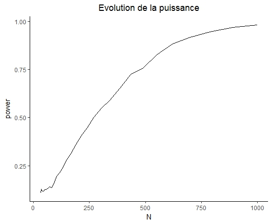

```{r setup, echo=FALSE, include=FALSE}
knitr::opts_knit$set(root.dir = "..")
```


```{r chargement source, include=FALSE}
source("Rscript/read_metagenomic_data.R")
source("Rscript/coda.R")
source("Rscript/comparaison_clustering.R")
source("Rscript/graph.R")
source("Rscript/bootstrap.R")
```

## Réduction de dimension


```{r echo=FALSE, warning=FALSE, cache=TRUE}
graph_biplot_normale(chaillou,metadata_chaillou$EnvType)[[1]]
```
La projetion des échantillons sur le plan formée par les deux premieres composantes principales suivent une loi normale bivariée (pour tous les groupes), de plus on s'aperéoit que les groupes sont bien séparé les uns des autres.

```{r echo=FALSE, warning=FALSE, cache=TRUE}
graph_biplot_normale(ravel,metadata_ravel$CST)[[1]]
```

Cette fois ci les échantillons sont moins bien séparé les uns des autres, seul le groupe 3 et 4 sont clairement distinguable. A l'inverse, seul le groupe 2 et 5 suivent une loi normale bivariée.

```{r echo=FALSE, warning=FALSE, cache=TRUE}
graph_biplot_normale(mach_500,metadata_mach$Weaned)[[1]]
```
Les deux groupes sont clairement distinguables. Cependant un seul groupe suit une loi normale.\newline
Les données brutes (sans réduction de variables) ne suivent pas une loi normale que se soit par groupe ou l'ensemble.

## Simulation

```{r simu1, fig.caption = "Dans R", echo=FALSE}

```

Comme attendu le nombre d'échantillons améliore la puissance du test de normalité.

```{r simu2, fig.caption = "Dans R", echo=FALSE}

```

Le bruit améliore la puisssance du test, cependant en augmentant la dimension (D) de la multinomiale, l'inverse se produit à partir d'un certains N. La précision informatique semble étre en cause (les valeurs propres de la matrice de covariance sont très faible).


\newpage

# Clustering kmeans

## Chaillou

```{r chaillou-kmeans, echo=FALSE, warning=FALSE, cache=TRUE, out.width="400px", out.height="300px", fig.align='center'}
k_chaillou <- comparaison_k_means(chaillou, metadata_chaillou$EnvType, 8, 1);

cat("comptage:\n")
print(k_chaillou$comptage_table)
cat("\nilr:\n")
print(k_chaillou$ilr_table)

k_chaillou$graphics[[1]]
k_chaillou$graphics[[2]]
k_chaillou$graphics[[3]]
```

\newpage

## ravel

```{r ravel-kmeans, echo=FALSE, warning=FALSE, cache=TRUE, out.width="400px", out.height="300px", fig.align='center'}
k_ravel <- comparaison_k_means(ravel, metadata_ravel$CST, 5, 1);

cat("comptage:\n")
print(k_ravel$comptage_table)
cat("\nilr:\n")
print(k_ravel$ilr_table)


k_ravel$graphics[[1]]
k_ravel$graphics[[2]]
k_ravel$graphics[[3]]
```

\newpage

## mach 500

```{r mach_500-kmeans, echo=FALSE, warning=FALSE, cache=TRUE, out.width="400px", out.height="300px", fig.align='center'}
k_mach_500 <- comparaison_k_means(mach_500, metadata_mach$Weaned, 2, 1);

cat("comptage:\n")
print(k_mach_500$comptage_table)
cat("\nilr:\n")
print(k_mach_500$ilr_table)


k_mach_500$graphics[[1]]
k_mach_500$graphics[[2]]
k_mach_500$graphics[[3]]
```

\newpage

## mach data complete

```{r mach-kmeans, echo=FALSE, warning=FALSE, cache=TRUE, out.width="400px", out.height="300px", fig.align='center'}
k_mach <- comparaison_k_means(mach, metadata_mach$Weaned, 2, 1);

cat("comptage:\n")
print(k_mach$comptage_table)
cat("\nilr:\n")
print(k_mach$ilr_table)


k_mach$graphics[[1]]
k_mach$graphics[[2]]
k_mach$graphics[[3]]
```

\newpage

# Clustering hclust

## Ravel

```{r ravel-hclust, echo=FALSE, warning=FALSE, cache=TRUE, out.width="400px", out.height="300px", fig.align='center'}

hclust_ravel <- comparaison_hclust(ravel, metadata_ravel$CST, 5, 1)

cat("comptage:\n")
print(hclust_ravel$comptage_table)
cat("\nilr:\n")
print(hclust_ravel$ilr_table)

hclust_ravel$graphics[[1]]
hclust_ravel$graphics[[2]]
hclust_ravel$graphics[[3]]
```


\newpage

## Mach 500

```{r mach_500-hclust, echo=FALSE, warning=FALSE, cache=TRUE, out.width="400px", out.height="300px", fig.align='center'}

hclust_mach_500 <- comparaison_hclust(mach_500, metadata_mach$Weaned, 2, 1)

cat("comptage:\n")
print(hclust_mach_500$comptage_table)
cat("\nilr:\n")
print(hclust_mach_500$ilr_table)

hclust_mach_500$graphics[[1]]
hclust_mach_500$graphics[[2]]
hclust_mach_500$graphics[[3]]
```


\newpage

## Chaillou

```{r chaillou-hclust, echo=FALSE, warning=FALSE, cache=TRUE, out.width="400px", out.height="300px", fig.align='center'}

hclust_chaillou <- comparaison_hclust(chaillou, metadata_chaillou$EnvType, 8, 1)

cat("comptage:\n")
print(hclust_chaillou$comptage_table)
cat("\nilr:\n")
print(hclust_chaillou$ilr_table)

hclust_chaillou$graphics[[1]]
hclust_chaillou$graphics[[2]]
hclust_chaillou$graphics[[3]]
```


\newpage

## Mach data complete

```{r mach-hclust, echo=FALSE, warning=FALSE, cache=TRUE, out.width="400px", out.height="300px", fig.align='center'}

hclust_mach <- comparaison_hclust(mach, metadata_mach$Weaned, 2, 1)

cat("comptage:\n")
print(hclust_mach$comptage_table)
cat("\nilr:\n")
print(hclust_mach$ilr_table)

hclust_mach$graphics[[1]]
hclust_mach$graphics[[2]]
hclust_mach$graphics[[3]]
```


# Clustering Mclust

## Ravel

```{r ravel-Mclust, echo=FALSE, warning=FALSE, cache=TRUE, out.width="400px", out.height="300px", fig.align='center'}

Mclust_ravel <- comparaison_Mclust(ravel, metadata_ravel$CST, 5, 1)

cat("comptage:\n")
print(Mclust_ravel$comptage_table)
cat("\nilr:\n")
print(Mclust_ravel$ilr_table)

Mclust_ravel$graphics[[1]]
Mclust_ravel$graphics[[2]]
Mclust_ravel$graphics[[3]]
```


\newpage

## Mach 500

```{r mach_500-Mclust, echo=FALSE, warning=FALSE, cache=TRUE, out.width="400px", out.height="300px", fig.align='center'}

Mclust_mach_500 <- comparaison_Mclust(mach_500, metadata_mach$Weaned, 2, 1)

cat("comptage:\n")
print(Mclust_mach_500$comptage_table)
cat("\nilr:\n")
print(Mclust_mach_500$ilr_table)

Mclust_mach_500$graphics[[1]]
Mclust_mach_500$graphics[[2]]
Mclust_mach_500$graphics[[3]]
```


\newpage

## Chaillou

```{r chaillou-Mclust, echo=FALSE, warning=FALSE, cache=TRUE, out.width="400px", out.height="300px", fig.align='center'}

Mclust_chaillou <- comparaison_Mclust(chaillou, metadata_chaillou$EnvType, 8, 1)

cat("comptage:\n")
print(Mclust_chaillou$comptage_table)
cat("\nilr:\n")
print(Mclust_chaillou$ilr_table)

Mclust_chaillou$graphics[[1]]
Mclust_chaillou$graphics[[2]]
Mclust_chaillou$graphics[[3]]
```


\newpage

## Mach data complete

```{r mach-Mclust, echo=FALSE, warning=FALSE, cache=TRUE, out.width="400px", out.height="300px", fig.align='center'}

Mclust_mach <- comparaison_Mclust(mach, metadata_mach$Weaned, 2, 1)

cat("comptage:\n")
print(Mclust_mach$comptage_table)
cat("\nilr:\n")
print(Mclust_mach$ilr_table)

Mclust_mach$graphics[[1]]
Mclust_mach$graphics[[2]]
Mclust_mach$graphics[[3]]
```